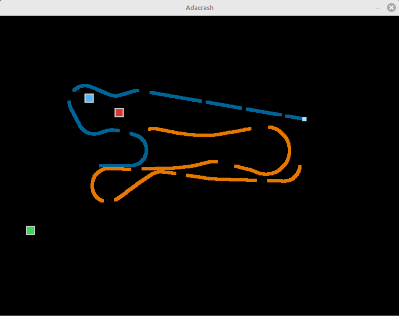

# Adacrash


Curve crash clone in Ada. You control the **cyan** curve; the **orange** curve is controlled by an AI.
Steer to stay a live - avoid your own trail, the opponents trail, and the walls.
The last curve moving wins.

## Requirements

| Dependency | Package (Debian/Ubuntu) |
|------------|------------------------|
| GNAT Ada compiler | `gnat` |
| GPRbuild | `gprbuild` |
| SDL2 | `libsdl2-dev` |

```bash
sudo apt install gnat gprbuild libsdl2-dev
```

## Building

```bash
make 
or 
make run
```

## Running

```bash
./bin/adacrash
```

## Controls

| Key | Action |
|-----|--------|
| <- Left arrow | Turn left |
| -> Right arrow | Turn right |
| `Space` | Restart after game over |
| `Esc` | Quit |

## Gameplay

* Both curves move continuously at constant speed.
* Every ~1.5 seconds a short **gap** appears in your trail - you can pass
  through the gap (your own or the opponent's).
* A curve dies when it hits a wall, its own trail, or the opponent's trail.
* Score is shown in the terminal after each round.

## Power-ups

Power-ups appears randomly across the arena and respawn ~5 seconds after
being picked up. **Both players can collect any power-up** - if the AI
picks up a red one, *you* get the bad effect!

| Colour | Effect | Duration |
|--------|--------|----------|
| Bright green | **Erase all** - clears every trail instantly | instant |
| Yellow-green | **Speed boost** - picker moves 1.5x faster | 6 s |
| Blue | **Wrap walls** - **both** players pass through walls and exit from the opposite side | 6 s |
| Bright red | **Thick trail** - opponent's trail becomes much wider | 6 s |
| Orange-red | **Slow opponent** - opponent moves at half speed | 6 s |

### Visual indicators

* **Blue arena border** - at least one player has the Wrap Walls effect active.
* **Yellow head glow** - that player has a speed boost active.
* **Dimmer trail colour** - that player is currently slowed.


## AI overview

The computer opponent uses a greedy angle-scan strategy each frame:

1. Evaluates **13 candidate directions** spanning +/-90 degrees around its current heading.
2. For each direction, run a **straight-line look-ahead** of up to 120 steps.
3. Score each direction based on:
   * Free steps ahead (obstacle distance)
   * Minimum wall clearance sampled at three points along the path
   * Penalty for sharp turns (prefer gentle curves)
   * Penalty for heading toward the player (proximity-scaled)
4. Steer one turn-step toward the highest-scoring direction.

